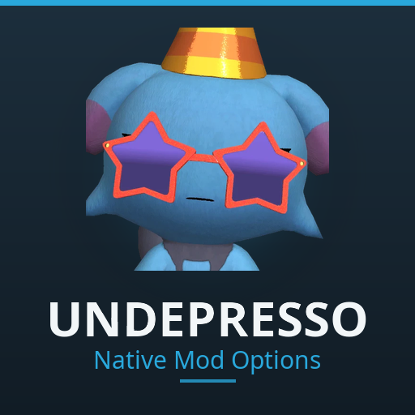

<p align="center">
  
</p>

# Native Mod Options

A settings screen for Palworld mods, built out of the game's own options widgets. Mods that support
it get their settings under **Options, Mod Options**, on the title screen and in the in-game ESC
menu, looking and behaving exactly like Graphics or Controls.


Every row in that screenshot is a real Palworld widget in the real settings screen. The tabs across
the top are one per registered mod.

## Installing

**Requires UE4SS.** Subscribe on the Steam Workshop and Palworld deploys both:

1. Subscribe to this mod on the Workshop.
2. Use the **Required Items** panel on its page, or **Subscribe to all**, to pick up
   [UE4SS Experimental (Palworld)](https://steamcommunity.com/sharedfiles/filedetails/?id=3625223587).
3. Launch Palworld, then Options, Mod Management, enable both, save.

That route gives you the UE4SS build this mod was tested against and lets Palworld handle updates
and load order. If you need a manual install instead, follow
[UE4SS's own documentation](https://docs.ue4ss.com/) rather than a copy of it here. One warning
worth repeating: a hand-placed `dwmapi.dll` next to a Workshop UE4SS deployment is two loaders in
one game, and it crashes on launch.

**This adds the menu, not the settings.** Installed by itself, the Mod Options entry appears and is
empty. What fills it is whatever mods you have that support it.

## What it gives you

- **The game's real widgets**, not drawings of them. They inherit Palworld's styling, focus states
  and gamepad navigation, and keep inheriting them when the game restyles.
- **Apply and Reset are the screen's own.** Hooked, not rebuilt, so the existing key guide drives
  them.
- **Seven row types.** Booleans, sliders, enums, keybinds. Sections, warnings and images for
  structure. Any row can be flagged as a warning or greyed out.
- **Keybinds that name their conflicts**, against both the player's key config and every other
  registered mod.
- **Event driven.** No timer, here or in mods using it. Idle costs nothing.
- **Values correct from your first frame**, so a mod never runs on defaults waiting for a menu.

Nothing is patched or replaced. It calls Palworld's own widget classes the way the game calls them,
which is why it works with the rest of the settings screen instead of fighting it.

## For mod authors

Copy `mod_options_client.lua` and `json.lua` into your mod's `Scripts/`, declare a schema, then call
`register()` and `subscribe()`. That is the whole integration.

```lua
local ModOptionsClient = require("mod_options_client")

local client = ModOptionsClient.new({
    id = "YourMod",
    title = "Your Mod",
    options = {
        { key = "Enabled", type = "boolean", label = "Enable the thing", default = true },
    },
})
client:register()
client:subscribe(function(key, value) applySettings() end)
```

Full schema and API reference: the [wiki](../../wiki), whose source is in `wiki/` if you are reading
this offline. `examples/Demo` is a runnable mod using every option type at once, and never reaches
players since it sits outside `Scripts/`.

**Treat it as an optional dependency.** Without it, `client.values` holds your defaults,
`register()` and `subscribe()` no-op, nothing errors. So do not gate features on it. Declare it with
**Add Required Item** on your Workshop page, not in `Info.json`'s `Dependencies`, which does not
propagate.

## Known limitations

- **Keybinds: A to Z, F1 to F12, Ctrl or Alt.** Not the whole keyboard, and no Shift. Every offered
  key becomes a permanent global bind that UE4SS cannot remove.
- **A rebind leaves the old bind resident**, inert but loaded, for the same reason.
- **The engine doesn't treat a combination as one key.** `Ctrl+R` fires both `R` and `Ctrl+R`. Fine
  in a lot of cases, conflicting in some others.
- **No text-entry row.** The options UI has no native widget for free text.
- **Panel width is fixed** to vanilla's 704 to 786, unchecked across resolutions.
- **A mod that registers late appears next time the panel opens.**

## Layout

```
NativeModOptions/
├── Info.json                 Workshop manifest
├── thumbnail.png             Workshop preview image
├── Scripts/                  The mod. main.lua is what UE4SS loads.
├── examples/Demo/            Runnable reference mod, every option type at once
├── tools/deploy-to-game.ps1  Copies Scripts/ into a local UE4SS install
├── wiki/                     Schema and API reference, source for the GitHub wiki
└── docs/LINKS.md             Reference links
```

Values persist to `<mod root>/<schema id>.ini`, outside `Scripts/` on purpose: UE4SS reloads a mod
when anything in its `Scripts/` folder is written, so saving there would restart the framework on
every Apply.

## Local development

`tools/deploy-to-game.ps1` copies `Scripts/` into your UE4SS `Mods` folder and adds a `mods.txt`
entry, disabled. Enable it by editing `mods.txt` directly, then relaunch: Mod Management lists
Workshop subscriptions only and never shows a locally deployed mod.

## Licence

MIT, brand assets reserved. `mod_options_client.lua` and `json.lua` are meant to be copied into your
own mod. See `LICENSE`.
